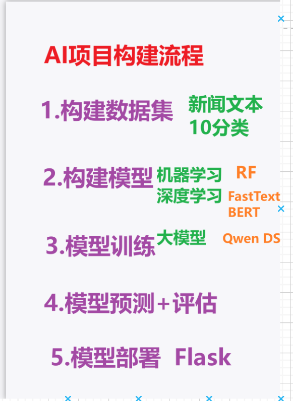
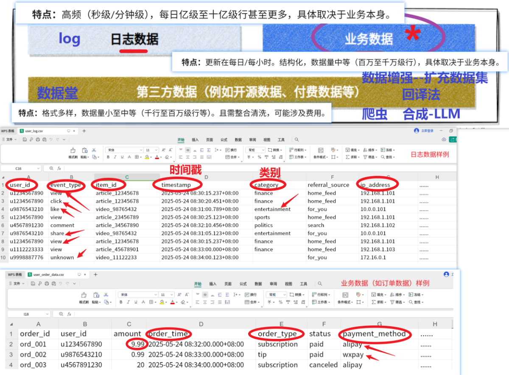
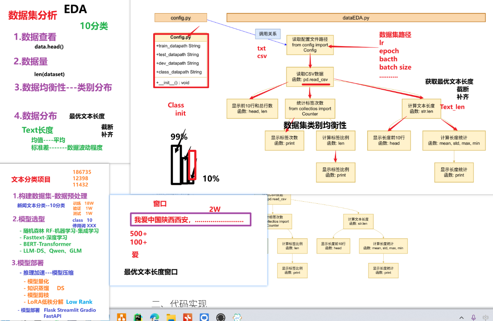
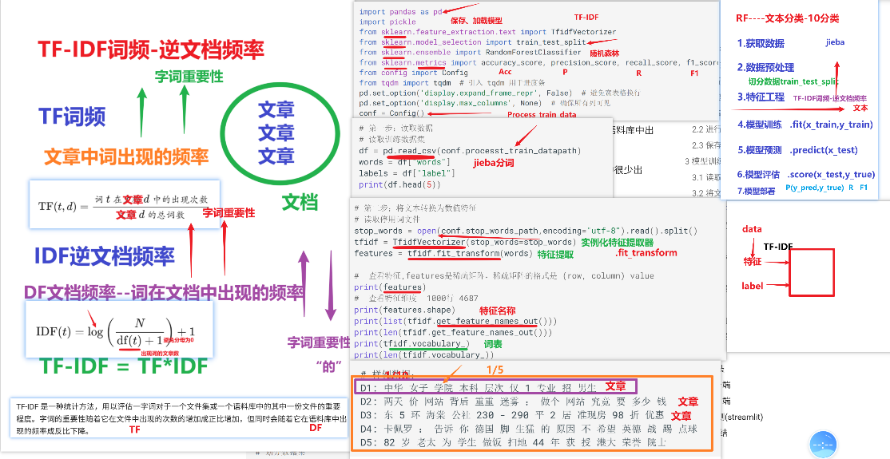
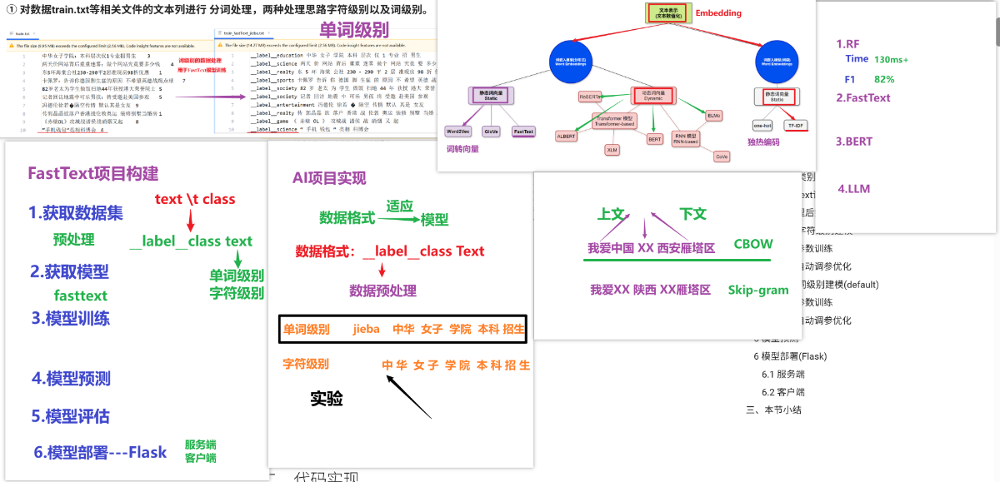
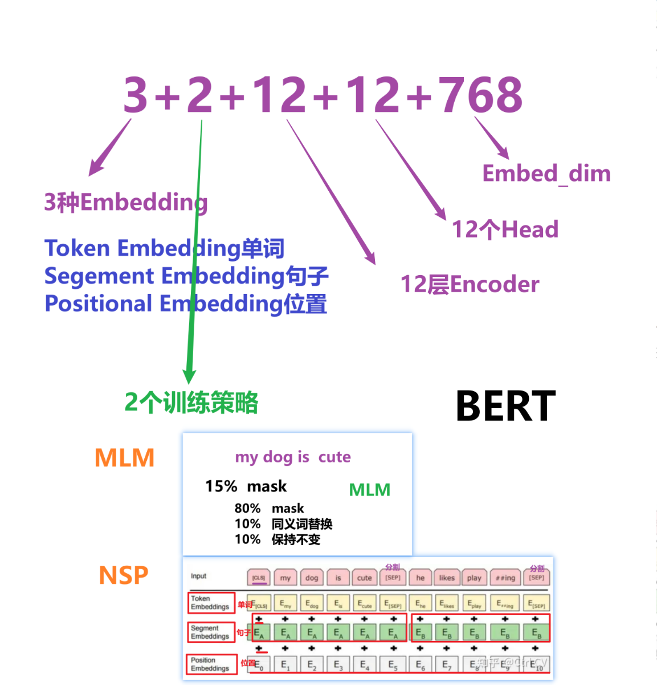
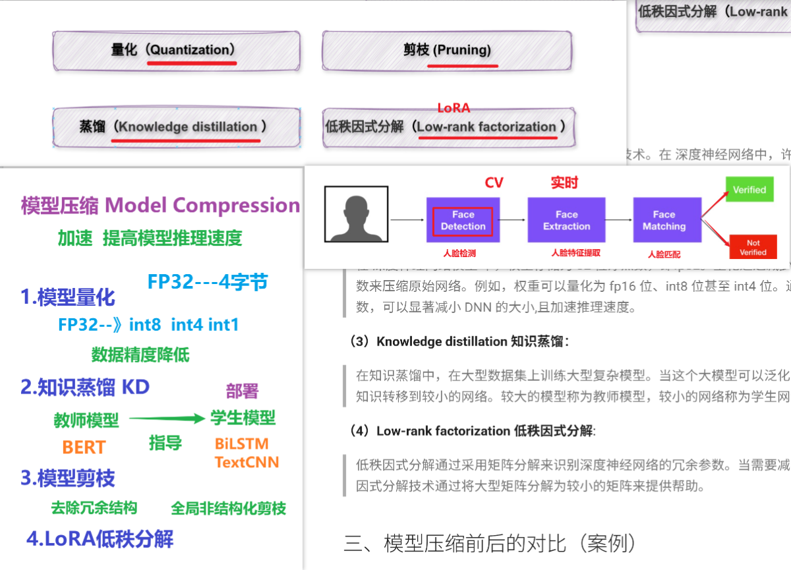
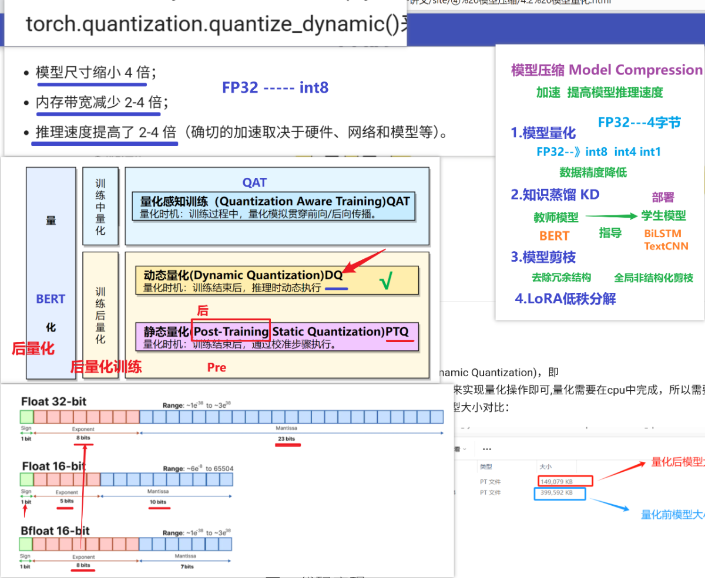
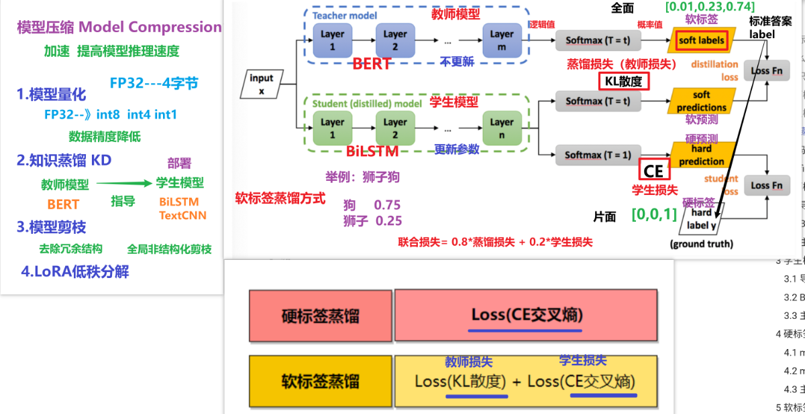

# NewsCompass 抽象版：通用 AI / NLP 项目方法论笔记

## 0. 这份笔记到底在干什么

这份笔记不是单纯复述 `NewsCompass` 项目。  
它做了两件事：

1. 把 `01-讲义 / 03-代码 / 04-笔记 / 06-上课笔记 / 05-拓展 PDF` 里的内容重新整理。
2. 把这个项目抽象成一套可迁移到`文本分类项目、NLP 项目、通用模型项目`的方法论。

主线只记一句：

> 一个完整项目永远是：`定问题 -> 拿数据 -> 看数据 -> 处理数据 -> 做表示 -> 训模型 -> 评模型 -> 部署 -> 优化`



---

## 1. 先把项目看成一个通用问题

### 1.1 项目本质

`NewsCompass` 在业务上是新闻文本分类。  
但抽象之后，它属于更大的这一类问题：

- 给一段输入
- 输出一个类别或一个决策
- 最终服务业务系统

所以它可以迁移到：

- 新闻分类
- 舆情分类
- 客服工单分类
- 商品评论分类
- 短文本意图识别
- 风险文本识别

### 1.2 需求分析时一定先回答的三个问题

- 为什么做：业务目标是什么
- 做什么：模型任务类型是什么
- 怎么算做好：成功标准是什么

### 1.3 以这个项目为例

- 为什么做：把新闻自动归类，给推荐系统做前置分发
- 做什么：中文短文本 10 分类
- 怎么算做好：先做出可用基线，再逐步提效果、做部署、做压缩

### 1.4 拓展：NLP 常见八大任务

这个 PDF 里补得很好，能帮你把“文本分类”放到更大的 NLP 全景里。

- 文本分类
- 分词
- 词性标注
- 命名实体识别 NER
- 情感分析
- 机器翻译
- 问答系统
- 语音识别

记忆抓手：

> 文本分类只是 NLP 的一个入口，不是 NLP 的全部。

---

## 2. 数据获取：所有项目最容易被忽视的难点

### 2.1 数据从哪来

这个项目里，数据来源可以抽象成三类：

| 数据类型 | 直观理解 | 典型特点 | 常见用途 |
|---|---|---|---|
| 日志数据 | 系统自动记下来的行为数据 | 高频、实时、量大、噪声多 | 推荐、风控、行为分析 |
| 业务数据 | 业务流程自然产生的数据 | 结构化强、字段稳定 | 标签构造、画像、静态特征 |
| 第三方数据 | 外部合作方或公开数据 | 格式多样、质量波动大 | 补充特征、冷启动增强 |



### 2.2 真实项目里拿数的四种状态

- 最舒服：直接拿到成品数据
- 次舒服：只拿到数据路径
- 更麻烦：拿到半成品数据，还要继续清洗
- 最难：只有需求，没有数据

这个抽象很重要，因为很多项目难点并不在算法，而在：

- 数据是否存在
- 标签能不能定义
- 数据够不够用

### 2.3 这个项目的数据集长什么样

核心数据文件在 `03-代码/01-data`：

- `train.txt`
- `dev.txt`
- `test.txt`
- `class.txt`

数据规模：

| 文件 | 数量 | 作用 |
|---|---:|---|
| `train.txt` | 180000 | 训练集 |
| `dev.txt` | 10000 | 验证集 |
| `test.txt` | 10000 | 测试集 |
| `class.txt` | 10 | 类别表 |

### 2.4 类别标签

- `finance`
- `realty`
- `stocks`
- `education`
- `science`
- `society`
- `politics`
- `sports`
- `game`
- `entertainment`

### 2.5 做项目时必须问的 5 个问题

- 标签是谁定义的
- 标签是不是可靠
- 训练集和测试集是否独立
- 有没有数据泄漏
- 数据分布会不会随时间漂移

记忆抓手：

> 数据不是“拿到就能用”，而是“拿到以后还要判断能不能建模”。

---

## 3. EDA：不是画图，是做建模前判断

### 3.1 EDA 主要看什么

这个项目的 EDA 思路非常典型：

1. 先看数据长什么样
2. 再看数据量
3. 再看类别分布
4. 再看文本长度分布
5. 再决定后续预处理和模型方案



### 3.2 项目里的 EDA 结论

- 一共 `10` 类
- 每类训练样本 `18000` 条
- 数据集是`完全均衡`的
- 平均文本长度 `19.21`
- 中位数 `19`
- `P90 = 24`
- `P95 = 25`
- 最大长度 `38`

### 3.3 这些结论为什么重要

- 类别均衡：说明不必优先担心类别偏置
- 文本很短：说明这是`短文本分类`
- 长度集中：说明可以安全做截断

### 3.4 EDA 的通用方法论

做文本分类项目，EDA 至少要做这四件事：

- 统计样本总量
- 统计每类样本数
- 统计文本长度
- 抽查脏样本和异常标签

### 3.5 抽象代码：EDA 模板

```python
import pandas as pd
from collections import Counter

df = pd.read_csv("train.txt", sep="\t", names=["text", "label"])

print(df.head())
print("总样本数:", len(df))

label_counts = Counter(df["label"])
print("类别分布:", label_counts)

df["text_len"] = df["text"].astype(str).str.len()
print("平均长度:", df["text_len"].mean())
print("最大长度:", df["text_len"].max())
print("中位数:", df["text_len"].median())
```

记忆抓手：

> EDA 的目标不是好看，而是决定后面“怎么处理数据、怎么选模型”。

---

## 4. 数据预处理：把原始数据变成可训练数据

### 4.1 这个项目做了哪些预处理

- 读取原始文本
- 中文分词
- 截断长度
- 生成处理后的结构化文件

项目里分词主要用的是 `jieba`。

### 4.2 为什么中文项目一定要关心分词

因为中文天然没有空格：

- 英文天然有词边界
- 中文没有天然词边界

所以在传统文本分类里，分词几乎是第一步。

### 4.3 这个项目为什么只保留前 30 个词

- 新闻标题本身很短
- 前部信息密度最高
- 控制稀疏特征维度
- 减少噪声和计算量

### 4.4 抽象代码：预处理模板

```python
import jieba
import pandas as pd

df = pd.read_csv("train.txt", sep="\t", names=["text", "label"])

def cut_sentence(text, max_words=30):
    words = list(jieba.cut(str(text)))[:max_words]
    return " ".join(words)

df["words"] = df["text"].apply(cut_sentence)
df.to_csv("process_train.csv", index=False)
```

### 4.5 拓展到 FastText 的预处理

FastText 的训练数据格式和普通 CSV 不一样。  
它要的是：

```text
__label__education 中 华 女 子 学 院 本 科 层 次 仅 1 专 业 招 男 生
```

抽象代码：

```python
id2name = {0: "finance", 1: "realty", ...}

with open("train.txt", "r", encoding="utf-8") as f:
    for line in f:
        text, label = line.strip().split("\t")
        label_name = f"__label__{id2name[int(label)]}"
        text_processed = " ".join(list(text))
        fasttext_line = f"{label_name} {text_processed}"
```

记忆抓手：

> 预处理不是越多越好，而是只做对下游表示和模型真正有帮助的处理。

---

## 5. 特征工程：先从 TF-IDF 讲透

### 5.1 为什么传统模型一定要做特征工程

因为随机森林、SVM、逻辑回归看不懂原始文本。  
它们只能吃数值特征。

所以必须先回答：

> 文本怎么变成向量？

### 5.2 TF-IDF 的定义

`TF-IDF = TF × IDF`

其中：

$$
\mathrm{TF\mbox{-}IDF}(t,d)=\mathrm{TF}(t,d)\times \mathrm{IDF}(t)
$$

$$
\mathrm{TF}(t,d)=\frac{\mathrm{count}(t,d)}{\sum_w \mathrm{count}(w,d)}
$$

$$
\mathrm{IDF}(t)=\log\left(\frac{N}{df(t)+1}\right)
$$

也常写成更平滑的版本：

$$
\mathrm{IDF}(t)=\log\left(\frac{N+1}{df(t)+1}\right)+1
$$

### 5.3 TF-IDF 的核心思想

最适合背的一句话：

> 一个词如果在当前文本里出现得多，但在整体语料里不常见，那么这个词更有类别区分能力。

### 5.4 TF-IDF 的优点和缺点

| 维度 | 结论 |
|---|---|
| 优点 | 简单、快、可解释、适合基线 |
| 缺点 | 不理解词序、不理解深层语义、高维稀疏 |



### 5.5 这个项目里怎么用 TF-IDF

- 先对文本做分词
- 把分词后的 `words` 列传给 `TfidfVectorizer`
- 得到稀疏向量
- 再送给随机森林

### 5.6 抽象代码：TF-IDF 模板

```python
from sklearn.feature_extraction.text import TfidfVectorizer

stop_words = open("stopwords.txt", encoding="utf-8").read().split()
vectorizer = TfidfVectorizer(stop_words=stop_words)

X = vectorizer.fit_transform(df["words"])
y = df["label"]
```

记忆抓手：

> TF-IDF 是最适合传统文本分类做第一版基线的表示方法。

---

## 6. Baseline：为什么先做随机森林

### 6.1 随机森林属于什么

- 集成学习
- Bagging 路线
- 基学习器通常是决策树

### 6.2 Bagging 和 Boosting 一定会被问

| 方法 | 核心特征 |
|---|---|
| Bagging | 并行训练 + 有放回采样 + 平权投票融合 |
| Boosting | 串行训练 + 关注错样本 + 加权投票融合 |

### 6.3 为什么先做随机森林基线

- 实现简单
- 训练快
- 可解释
- 对 TF-IDF 稀疏特征友好

### 6.4 这个项目里的随机森林流程

1. 读取处理后数据
2. 取 `words` 和 `label`
3. TF-IDF 向量化
4. `train_test_split`
5. `RandomForestClassifier`
6. 训练
7. 预测
8. 评估
9. 保存模型和向量化器

### 6.5 抽象代码：随机森林基线模板

```python
from sklearn.model_selection import train_test_split
from sklearn.ensemble import RandomForestClassifier
from sklearn.metrics import accuracy_score, precision_score, recall_score, f1_score

X_train, X_test, y_train, y_test = train_test_split(X, y, test_size=0.2)

model = RandomForestClassifier(n_estimators=100)
model.fit(X_train, y_train)

y_pred = model.predict(X_test)

print("acc =", accuracy_score(y_test, y_pred))
print("precision =", precision_score(y_test, y_pred, average="micro"))
print("recall =", recall_score(y_test, y_pred, average="micro"))
print("f1 =", f1_score(y_test, y_pred, average="micro"))
```

### 6.6 这个项目里的基线结果

- Accuracy：`82.48%`
- Precision(micro)：`82.48%`
- Recall(micro)：`82.48%`
- F1(micro)：`82.48%`

最适合背的一句话：

> 随机森林 + TF-IDF 在 10 分类短文本任务上做到约 82.48%，已经足够构成一个可用的基线模型 1.0。

---

## 7. 模型升级路线：FastText、BERT、大模型

这一节是把 `03-代码 + 04-笔记 + PDF` 的知识点真正并回模型路线里。

### 7.1 模型升级的总逻辑

- 第一步：先有基线
- 第二步：再追求更高效果
- 第三步：最后考虑上线成本

### 7.2 FastText

#### 它是什么

FastText 是一个轻量级文本分类模型。  
PDF 里补充的重点是：

- 底层与 `CBOW` 思想相关
- 可以引入 `n-gram`
- 速度快
- 精度不差

#### 为什么它比 TF-IDF 更进一步

- 不再只是纯统计特征
- 有一定分布式表示能力
- 在轻量方案里非常实用



#### 抽象代码：FastText 模板

```python
import fasttext

model = fasttext.train_supervised(input="train_fastText_char.txt")
model.save_model("fastText_char.bin")

print(model.predict("《 赤 壁 O L 》 攻 城 战 诸 侯 战 硝 烟 又 起"))
print(model.test("test_fastText_char.txt"))
```

#### 项目里的结果

根据 `04-笔记`：

- 在 `10000` 条测试集上
- FastText 精确率和召回率约 `0.8767`

这说明：

> FastText 相比随机森林基线已经有明显提升，而且训练和部署依然很轻。

---

### 7.3 BERT

#### 它是什么

`BERT = Bidirectional Encoder Representations from Transformers`

核心是：

- 双向 Transformer
- 用上下文理解词义
- 不是一个词一个固定向量，而是“上下文相关表示”

#### PDF 补充的两个预训练任务

1. `MLM`：Masked Language Model
2. `NSP`：Next Sentence Prediction

MLM 的典型规则：

- 15% token 被选中参与预测
- 其中 80% 真替换成 `[MASK]`
- 10% 换成随机词
- 10% 保持不变

#### BERT 结构知识点

- 3 种 embedding：Token / Segment / Position
- 12 层 Encoder
- 12 个 Attention Head
- 隐藏维度 `768`



#### BERT 配套知识点：GELU

PDF 里补了 `GELU` 激活函数，公式如下：

$$
\mathrm{GELU}(x)=0.5x\left(1+\tanh\left(\sqrt{\frac{2}{\pi}}\left(x+0.044715x^3\right)\right)\right)
$$

它比 ReLU 更平滑，常见于 Transformer/BERT 系列模型。

#### 抽象代码：BERT 分类器模板

```python
import torch.nn as nn
from transformers import BertModel

class BertClassifier(nn.Module):
    def __init__(self, bert_path, num_classes=10):
        super().__init__()
        self.bert = BertModel.from_pretrained(bert_path)
        self.fc = nn.Linear(768, num_classes)

    def forward(self, input_ids, attention_mask):
        outputs = self.bert(input_ids=input_ids, attention_mask=attention_mask)
        cls = outputs.last_hidden_state[:, 0, :]
        logits = self.fc(cls)
        return logits
```

#### 抽象代码：BERT 训练模板

```python
from transformers import AdamW
import torch.nn as nn

model = BertClassifier("bert-base-chinese").to(device)
optimizer = AdamW(model.parameters(), lr=5e-5)
criterion = nn.CrossEntropyLoss()

for batch in train_loader:
    optimizer.zero_grad()
    logits = model(batch["input_ids"], batch["attention_mask"])
    loss = criterion(logits, batch["label"])
    loss.backward()
    optimizer.step()
```

#### 项目里的结果

根据 `04-笔记`：

- BERT 验证集 F1 / Acc 可达到 `93.17%`

这说明：

> BERT 是这个项目里效果显著提升的一条核心路线。

---

### 7.4 TextCNN：为什么也值得知道

虽然这个项目主线不是 TextCNN，但 PDF 补得很实用。

TextCNN 的关键点：

- 本质上是用一维卷积提取文本中的 `n-gram` 特征
- 对短文本特别有效
- 速度快
- 对长距离建模较弱
- 对语序的感知不如 Transformer

你可以把它记成：

> TextCNN 是短文本分类中常见的轻量深度学习基线。

---

### 7.5 大模型路线

在这个项目中，大模型路线主要被当成更高阶方案：

- 零样本分类
- 提示词分类
- 更强泛化

但它也意味着：

- 推理成本更高
- 部署成本更高
- 稳定性和工程成本更高

所以真正做项目时，大模型不是默认答案，而是`在业务收益足够大时才值得付出成本的方案`。

---

## 8. 训练、损失函数与评估

### 8.1 训练阶段真正要记的不是“跑通”

而是：

- 训练/验证/测试切分
- 损失函数
- 优化器
- 评估指标
- 模型保存

### 8.2 为什么模型和向量化器都要保存

传统文本分类里必须同时保存：

- 模型
- 向量化器

因为：

- 模型决定分类规则
- 向量化器决定输入特征空间

抽象代码：

```python
import pickle

with open("rf_model.pkl", "wb") as f:
    pickle.dump(model, f)

with open("tfidf_vectorizer.pkl", "wb") as f:
    pickle.dump(vectorizer, f)
```

### 8.3 分类任务里的交叉熵

交叉熵最常用于监督学习分类任务。

二分类 / 多分类都可以写成概率分布形式：

$$
H(P,Q)=-\sum_i P(i)\log Q(i)
$$

直观理解：

> 真实分布是 \(P\)，模型预测分布是 \(Q\)，交叉熵衡量模型预测和真实标签之间的差距。

### 8.4 KL 散度

KL 散度公式：

$$
D_{KL}(P\|Q)=\sum_i P(i)\log \frac{P(i)}{Q(i)}
$$

它常出现在：

- 蒸馏
- 概率分布匹配
- 生成模型

### 8.5 KL 与交叉熵的关系

$$
D_{KL}(P\|Q)=H(P,Q)-H(P)
$$

最适合背的一句话：

> 交叉熵更常见于监督分类训练，KL 散度更常见于分布对齐和蒸馏。

### 8.6 评估指标

这个项目实际使用了：

- Accuracy
- Precision
- Recall
- F1
- classification_report

它们的记法：

- Accuracy：整体对了多少
- Precision：预测成某类的，有多少是真的
- Recall：真的属于某类的，有多少被找出来
- F1：Precision 和 Recall 的平衡

### 8.7 micro 和 macro

- `micro`：先汇总所有样本再算，适合看整体表现
- `macro`：每类先算再平均，适合看类别公平性

这个项目由于类别均衡，所以 `micro` 很适合用来看整体效果。

---

## 9. API、服务化与前后端联动

### 9.1 API 是什么

一句话：

> API 是模型对外提供能力的接口。

### 9.2 这个项目里的核心接口

- 路由：`/predict`
- 方法：`POST`
- 输入：JSON
- 字段：`text`
- 输出：预测类别 JSON

### 9.3 Flask 四步法

1. 导入依赖
2. 实例化 Flask 对象
3. 定义路由和处理函数
4. 启动服务监听端口

### 9.4 抽象代码：服务端 Flask API 模板

```python
from flask import Flask, request, jsonify

app = Flask(__name__)

@app.route("/predict", methods=["POST"])
def predict_api():
    data = request.get_json()
    if not data or "text" not in data:
        return jsonify({"error": "Missing text field"}), 400

    result = predict(data["text"])
    return jsonify(result)

if __name__ == "__main__":
    app.run(host="0.0.0.0", port=8001)
```

### 9.5 抽象代码：Streamlit 调用模板

```python
import streamlit as st
import requests
import time

text_input = st.text_area("请输入文本")

if st.button("预测"):
    start_time = time.time()
    resp = requests.post(
        "http://localhost:8001/predict",
        json={"text": text_input}
    )
    elapsed = (time.time() - start_time) * 1000
    st.write(resp.json())
    st.write(f"耗时: {elapsed:.2f} ms")
```

### 9.6 FastText / BERT / RF 服务化是怎么统一的

虽然模型不同，但服务化结构是一致的：

- 统一输入：文本
- 统一接口：`/predict`
- 统一格式：JSON 请求 / JSON 响应
- 统一前端：页面发请求、展示结果

记忆抓手：

> 模型不同，服务接口可以统一；训练不同，调用方式可以一致。

---

## 10. 模型压缩与上线优化

### 10.1 为什么要做压缩

因为真实上线看的是：

- 模型大小
- 推理速度
- CPU/GPU 资源
- 部署成本

### 10.2 三种主流压缩技术

| 技术 | 核心动作 | 解决的问题 |
|---|---|---|
| 量化 | 降参数精度 | 更小、更快 |
| 蒸馏 | 大模型教小模型 | 小模型保留更多能力 |
| 剪枝 | 去冗余参数 | 降复杂度 |



### 10.3 量化

#### 核心概念

- `float32 -> int8`
- 典型收益是减小体积和加速推理
- 项目里主要讲的是`动态量化`



#### 抽象代码：量化模板

```python
import torch

model.load_state_dict(torch.load(model_path, map_location="cpu"))
model.eval()

quantized_model = torch.quantization.quantize_dynamic(
    model,
    {torch.nn.Linear},
    dtype=torch.qint8
)
```

#### 项目里的结果

- 量化后模型内存：`63.55MB`
- 模型大小变化：`390MB -> 145MB`
- 压缩率约 `62.8%`
- 推理时间提升约 `82.4%`

### 10.4 蒸馏

#### 核心概念

- 教师模型：大模型
- 学生模型：小模型
- 让学生模型学习教师模型输出的分布信息



#### 蒸馏损失

常见抽象写法：

$$
\mathcal{L}=\alpha T^2 D_{KL}(P_t^T \| P_s^T) + (1-\alpha)\, CE(y, P_s)
$$

其中：

- \(T\) 是温度
- \(P_t^T\) 是教师模型软标签分布
- \(P_s^T\) 是学生模型软预测分布
- \(CE\) 是交叉熵

#### 抽象代码：软标签蒸馏模板

```python
soft_loss = kl_div(
    log_softmax(student_logits / T),
    softmax(teacher_logits / T)
) * (T * T)

hard_loss = cross_entropy(student_logits, labels)
loss = alpha * soft_loss + (1 - alpha) * hard_loss
```

#### 项目里的结果

- Teacher Acc：`93.64%`
- Student Acc：`89.89%`
- 蒸馏后 BiLSTM Acc：`91.25%`
- 体积变化：`390MB -> 104MB`
- 剩余比例：`26.7%`

### 10.5 剪枝

#### 核心概念

- 删除冗余连接
- 构造稀疏模型
- 降低计算复杂度

项目里做的是：

- BERT 注意力层
- 全局非结构化剪枝
- 剪枝比例 `30%`
- 依据 `L1` 范数

#### 抽象代码：剪枝模板

```python
import torch.nn.utils.prune as prune

parameters_to_prune = [
    (model.bert.encoder.layer[i].attention.self.query, "weight")
    for i in range(12)
]

prune.global_unstructured(
    parameters_to_prune,
    pruning_method=prune.L1Unstructured,
    amount=0.3
)
```

#### 项目里的结果

- 剪枝后 Accuracy：`0.9400`
- 剪枝后 F1：`0.9187`
- 稀疏度：`0.3000`

记忆抓手：

- 量化：降精度
- 蒸馏：学知识
- 剪枝：删参数

---

## 11. 高频知识点清单

### 11.1 项目主线

- 先定问题，再拿数据
- 先做基线，再做升级
- 先离线评估，再服务部署
- 最后做压缩和上线优化

### 11.2 数据层

- 数据来源分：日志、业务、第三方
- 做项目先问标签、泄漏、分布、漂移
- EDA 决定后续处理和模型路线

### 11.3 特征层

- 传统文本分类最经典的基线表示是 TF-IDF
- TF-IDF 核心思想是局部高频、全局低频
- TF-IDF 简单、快、可解释，但不理解深层语义

### 11.4 模型层

- 随机森林是传统基线
- FastText 是轻量级升级
- BERT 是高效果升级
- 大模型是更高阶但更贵的方案

### 11.5 训练层

- 模型和向量化器必须一起保存
- 训练和推理必须共享同一套预处理逻辑
- BERT 常用 AdamW + CrossEntropyLoss

### 11.6 评估层

- Accuracy 看整体
- Precision 看误报
- Recall 看漏报
- F1 看平衡
- micro 适合看整体，macro 适合看类别公平性

### 11.7 部署层

- API 是模型能力接口
- `/predict + POST + JSON` 是最常见形式
- Flask 负责服务化
- Streamlit 负责交互展示

### 11.8 优化层

- 量化让模型更小更快
- 蒸馏让小模型学大模型
- 剪枝去掉冗余参数

---

## 12. 最后的高度抽象

如果只保留最核心的三句话，就记这三句：

- 模型项目先解决业务问题，再解决算法问题。
- 项目一定先做可用基线，再逐步追求上限。
- 最终交付不是模型文件，而是一套能稳定上线的能力。
