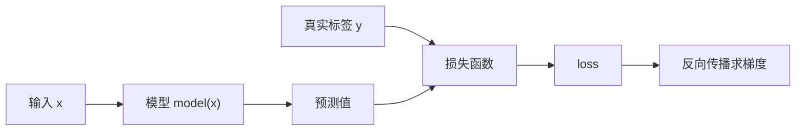

# Day03-Day06 深度学习与 PyTorch 基础整理版

> 生成日期：2026-05-18  
> 输出位置：`/Users/yaoyao/Desktop/day03_day06_深度学习与PyTorch基础_整理版.md`  
> 整理范围：`day03 深度学习入门`、`day04 张量计算和形状转换`、`day05 深度学习基础`、`day06 损失函数和优化器`

---

## 0. 资料来源与整理说明

本文件基于原目录中的授课笔记、备课笔记、安装说明和图片素材进行抽取整理。处理原则如下：

1. 不修改原始文件夹、原始文件名、原始层级结构。
2. 对重复内容进行合并，例如 `day05` 中授课笔记与备课笔记关于激活函数、参数初始化的重复部分合并为统一章节。
3. 对明显不准确或容易误解的表达进行修正，例如 `CrossEntropyLoss` 的输入、`BCELoss` 拼写、`CUDA Toolkit` 与 `cuDNN` 拼写、`torch.cat` 与 `torch.stack` 的区别。
4. 保留学习者真正需要掌握的主线：环境搭建 -> Tensor -> 运算与形状 -> Autograd -> 神经网络 -> 激活函数 -> 初始化 -> 损失函数 -> 优化器 -> 训练流程。
5. 图片内容作为原资料资源索引保留，便于回到原始素材查看截图、曲线图和课堂演示图。

| 来源目录 | 文件数 | 核心文本 | 图片素材 | 主要主题 |
| --- | ---: | ---: | ---: | --- |
| `day03 深度学习入门` | 33 | 3 | 30 | 环境搭建、深度学习入门、Tensor 定义与创建 |
| `day04 张量计算和形状转换` | 40 | 1 | 39 | Tensor/NumPy 转换、运算、索引、形状变换 |
| `day05 深度学习基础` | 21 | 2 | 18 | 张量拼接、Autograd、神经网络、激活函数、参数初始化 |
| `day06 损失函数和优化器` | 37 | 1 | 35 | 损失函数、梯度下降、反向传播、优化器 |

### 核心文本文件

### day03 深度学习入门
- `/Users/yaoyao/Desktop/大模型学习/机器学习，深度学习/大模型核心技术/03 笔记/day03 深度学习入门/Day03：02 深度学习入门与张量创建-授课笔记.md`
- `/Users/yaoyao/Desktop/大模型学习/机器学习，深度学习/大模型核心技术/03 笔记/day03 深度学习入门/day03 01 深度学习环境搭建 -授课笔记.md`
- `/Users/yaoyao/Desktop/大模型学习/机器学习，深度学习/大模型核心技术/03 笔记/day03 深度学习入门/torch的cuda版本安装.txt`

### day04 张量计算和形状转换
- `/Users/yaoyao/Desktop/大模型学习/机器学习，深度学习/大模型核心技术/03 笔记/day04 张量计算和形状转换/day04 张量计算和形状转换-授课笔记.md`

### day05 深度学习基础
- `/Users/yaoyao/Desktop/大模型学习/机器学习，深度学习/大模型核心技术/03 笔记/day05 深度学习基础/day05 张量的拼接操作和激活函数-备课笔记.md`
- `/Users/yaoyao/Desktop/大模型学习/机器学习，深度学习/大模型核心技术/03 笔记/day05 深度学习基础/day05 张量的拼接操作和激活函数-授课笔记.md`

### day06 损失函数和优化器
- `/Users/yaoyao/Desktop/大模型学习/机器学习，深度学习/大模型核心技术/03 笔记/day06 损失函数和优化器/day06损失函数和优化器-授课笔记.md`

---

## 1. 学习总览：从 Tensor 到训练一个神经网络

深度学习的学习路径可以理解为一条“数据变成模型能力”的流水线：


这四天资料的核心目标不是先背大量公式，而是建立下面几个关键认识：

| 学习模块 | 解决的问题 | 必须掌握的关键词 |
| --- | --- | --- |
| 环境搭建 | 让代码能跑起来，并知道 CPU、CUDA、MPS 的区别 | `Python`、`conda`、`pip`、`PyTorch`、`CUDA`、`MPS` |
| Tensor 基础 | 用统一的数据结构表示数字、向量、矩阵、图片、文本特征 | `Tensor`、`shape`、`dtype`、`device` |
| Tensor 运算 | 用张量完成加减乘除、矩阵乘法、统计和广播 | broadcasting、`matmul`、`sum`、`mean` |
| 形状变换 | 让数据形状符合模型输入输出要求 | `reshape`、`view`、`transpose`、`permute`、`cat`、`stack` |
| Autograd | 自动计算梯度，不需要手写复杂求导 | `requires_grad`、`.grad`、`loss.backward()` |
| 神经网络 | 用层、激活函数和参数组合成可学习模型 | `nn.Module`、`Linear`、activation |
| 损失函数 | 衡量预测值和真实值之间的差距 | `CrossEntropyLoss`、`BCEWithLogitsLoss`、`MSELoss` |
| 优化器 | 根据梯度更新模型参数 | `SGD`、`Momentum`、`Adam`、`AdamW` |

---

## 2. 环境搭建：CPU、NVIDIA CUDA 与 Apple Silicon MPS

### 2.1 PyTorch 是什么

`PyTorch` 是一个深度学习框架，主要提供三类能力：

1. `Tensor`：高效的多维数组，类似增强版 `NumPy ndarray`。
2. `Autograd`：自动微分系统，可以自动计算梯度。
3. `torch.nn` 与 `torch.optim`：用于搭建神经网络、定义损失函数和优化模型参数。

### 2.2 CPU、GPU、CUDA、MPS 的区别

| 名称 | 完整解释 | 作用 | 适用设备 |
| --- | --- | --- | --- |
| `CPU` | Central Processing Unit，中央处理器 | 通用计算，所有电脑都有 | Windows、macOS、Linux |
| `GPU` | Graphics Processing Unit，图形处理器 | 大量并行计算，适合深度学习 | NVIDIA/AMD/Apple 等 |
| `CUDA` | Compute Unified Device Architecture | NVIDIA 提供的 GPU 计算平台 | NVIDIA 显卡 |
| `CUDA Toolkit` | CUDA 工具包 | 提供编译器、运行库等 CUDA 开发组件 | NVIDIA CUDA 开发环境 |
| `cuDNN` | CUDA Deep Neural Network library | NVIDIA 深度神经网络加速库 | NVIDIA CUDA 深度学习 |
| `MPS` | Metal Performance Shaders | Apple 的 GPU 加速后端 | Apple Silicon / 部分 macOS 设备 |

### 2.3 安装建议

#### 只有 CPU 或暂时不需要 GPU

适合初学阶段、张量练习、小模型训练：

```bash
pip install torch torchvision torchaudio
```

在 macOS 上，PyTorch 官方安装页给出的基础命令通常也是 `pip3 install torch torchvision` 或同类命令；具体命令应以官方安装选择器为准。

#### Windows/Linux + NVIDIA GPU

如果电脑有 NVIDIA 显卡，应先确认驱动和 CUDA 能否被系统识别：

```bash
nvidia-smi
```

如果命令能输出显卡、驱动版本、CUDA 版本等信息，再到 PyTorch 官方安装页选择：

- 操作系统：`Windows` 或 `Linux`
- 包管理器：`pip` 或 `conda`
- 语言：`Python`
- 计算平台：匹配机器的 `CUDA` 版本

示例命令只代表某个时间点的版本组合，不能当作永远固定的安装命令：

```bash
pip install torch torchvision torchaudio --index-url https://download.pytorch.org/whl/cu126
```

#### macOS + Apple Silicon

Apple M 系列芯片不使用 NVIDIA `CUDA`。如果要用 GPU 加速，应走 `MPS` 路线：

```python
import torch

if torch.backends.mps.is_available():
    device = torch.device("mps")
else:
    device = torch.device("cpu")

x = torch.ones(3, device=device)
print(x, x.device)
```

对 Apple Silicon 用户来说，通常不需要安装 `NVIDIA驱动`、`CUDA Toolkit`、`cuDNN`、`pytorch-cuda`。这些属于 NVIDIA CUDA 生态。

### 2.4 环境搭建易错点修正

| 原资料中容易误解的点 | 修正后的准确表达 |
| --- | --- |
| `CUDA tookit` | 正确拼写是 `CUDA Toolkit` |
| `cudann` | 正确拼写是 `cuDNN` |
| 所有 GPU 都按 CUDA 安装 | 只有 NVIDIA GPU 走 CUDA；Apple Silicon 走 `MPS`；AMD 通常看 `ROCm` 支持 |
| 安装命令固定不变 | PyTorch 版本、Python 版本、CUDA 版本会变化，应优先使用官方安装页生成命令 |

---

## 3. Tensor 基础：深度学习里的统一数据容器

### 3.1 Tensor 的定义

`Tensor` 可以理解为“多维数字表”。深度学习模型不能直接理解图片、文字、声音，它们最终都要被转成数字，再组织成 `Tensor`。

常见维度如下：

| 名称 | 维度 | 示例 | 说明 |
| --- | ---: | --- | --- |
| 标量 scalar | 0 维 | `tensor(3.14)` | 一个数字 |
| 向量 vector | 1 维 | `tensor([1, 2, 3])` | 一排数字 |
| 矩阵 matrix | 2 维 | `tensor([[1,2],[3,4]])` | 行列结构 |
| 多维张量 tensor | 3 维及以上 | `shape=(32, 3, 224, 224)` | 批量图片、序列数据等 |

常用属性：

```python
import torch

x = torch.tensor([[1, 2, 3], [4, 5, 6]])

print(x.ndim)      # 维度数量，结果为 2
print(x.shape)     # 形状，结果为 torch.Size([2, 3])
print(x.size())    # 与 x.shape 类似
print(x.dtype)     # 数据类型
print(x.device)    # 所在设备，例如 cpu、cuda:0、mps
```

### 3.2 shape 的含义

`shape` 描述每个维度有多少个元素。例如：

```python
x = torch.randn(4, 3, 2)
print(x.shape)  # torch.Size([4, 3, 2])
```

可以读作：

- 第 0 维有 4 个元素。
- 第 1 维有 3 个元素。
- 第 2 维有 2 个元素。

在深度学习中，常见图片批次 `shape` 为：

```text
[batch_size, channels, height, width]
```

例如 `[32, 3, 224, 224]` 表示：一次输入 32 张图片，每张图片 3 个通道，尺寸为 224 x 224。

### 3.3 dtype 数据类型

| PyTorch 类型 | 含义 | 常见用途 |
| --- | --- | --- |
| `torch.float32` / `torch.FloatTensor` | 32 位浮点数 | 神经网络参数、特征、一般训练默认类型 |
| `torch.float64` / `torch.DoubleTensor` | 64 位浮点数 | 高精度数值计算 |
| `torch.int64` / `torch.LongTensor` | 64 位整数 | 分类标签索引，尤其是 `CrossEntropyLoss` 的类别标签 |
| `torch.int32` / `torch.IntTensor` | 32 位整数 | 一般整数数据 |
| `torch.int16` / `torch.ShortTensor` | 16 位整数 | 特定低精度场景 |
| `torch.bool` | 布尔值 | 条件筛选、mask |

一个重要习惯：

- 模型输入特征通常用浮点数，例如 `float32`。
- 多分类标签索引通常用 `long`，也就是 `torch.int64`。
- 二分类或多标签任务的目标值通常用浮点数，例如 `0.0` 和 `1.0`。

---

## 4. Tensor 创建方法

### 4.1 根据已有数据创建

```python
import torch

a = torch.tensor([1, 2, 3])
b = torch.tensor([[1.0, 2.0], [3.0, 4.0]])

print(a)
print(b)
```

`torch.tensor(data)` 会根据输入数据创建一个新 `Tensor`，并且通常会复制数据。

### 4.2 `torch.tensor` 与 `torch.Tensor`

这两个写法很容易混淆：

```python
torch.tensor([1, 2, 3])  # 推荐：根据明确数据创建
torch.Tensor([1, 2, 3])  # 也能根据数据创建，默认浮点类型
torch.Tensor(2, 3)       # 创建形状为 (2, 3) 的未初始化 Tensor
```

关键区别：

| 写法 | 含义 | 建议 |
| --- | --- | --- |
| `torch.tensor(data)` | 根据数据创建，并复制数据 | 推荐用于明确数据 |
| `torch.Tensor(data)` | 构造默认浮点 Tensor | 初学者不建议优先使用 |
| `torch.Tensor(shape...)` | 创建未初始化内存 | 容易出现看似随机的值，不建议新手使用 |
| `torch.empty(shape)` | 明确创建未初始化 Tensor | 只在知道自己要立即覆盖内容时使用 |
| `torch.zeros(shape)` | 全 0 Tensor | 推荐 |
| `torch.ones(shape)` | 全 1 Tensor | 推荐 |

### 4.3 指定形状创建

```python
torch.zeros(2, 3)        # 2 行 3 列，全 0
torch.ones(2, 3)         # 2 行 3 列，全 1
torch.full((2, 3), 7)    # 2 行 3 列，全 7
torch.empty(2, 3)        # 未初始化，不保证值有意义
```

对应的 `_like` 方法会参考已有张量的形状：

```python
x = torch.randn(2, 3)

torch.zeros_like(x)
torch.ones_like(x)
torch.full_like(x, 9)
```

### 4.4 创建线性序列

```python
torch.arange(0, 10, 2)       # tensor([0, 2, 4, 6, 8])
torch.linspace(0, 1, 5)      # tensor([0.0000, 0.2500, 0.5000, 0.7500, 1.0000])
```

区别：

| 方法 | 控制方式 | 是否包含终点 |
| --- | --- | --- |
| `torch.arange(start, end, step)` | 按步长生成 | 通常不包含 `end` |
| `torch.linspace(start, end, steps)` | 按点数生成 | 包含 `start` 和 `end` |

### 4.5 随机张量与随机种子

```python
torch.rand(2, 3)     # 0 到 1 之间均匀分布
torch.randn(2, 3)    # 标准正态分布
torch.randint(0, 10, (2, 3))  # [0, 10) 内的整数
```

为了让随机结果可复现，可以设置随机种子：

```python
torch.manual_seed(42)
x1 = torch.randn(2, 3)

torch.manual_seed(42)
x2 = torch.randn(2, 3)

print(torch.equal(x1, x2))  # True
```

如果只想控制局部随机数生成，可以使用 `torch.Generator`：

```python
g = torch.Generator().manual_seed(42)
x = torch.randn(2, 3, generator=g)
```

### 4.6 类型转换

```python
x = torch.tensor([1, 2, 3])

x.float()
x.double()
x.long()
x.int()
x.to(dtype=torch.float32)
```

更通用的写法是 `.to()`：

```python
x = x.to(dtype=torch.float32)
x = x.to(device="cpu")
```

如果使用 GPU/MPS，也常写成：

```python
device = torch.device("cuda" if torch.cuda.is_available() else "cpu")
x = x.to(device)
```

在 Apple Silicon 上可根据 `MPS` 判断：

```python
device = torch.device("mps" if torch.backends.mps.is_available() else "cpu")
x = x.to(device)
```

---

## 5. Tensor、NumPy 与 Python 数字互转

### 5.1 Tensor 转 NumPy

对于普通 CPU Tensor：

```python
import torch

x = torch.tensor([1, 2, 3])
arr = x.numpy()
```

注意：默认情况下，CPU Tensor 与返回的 NumPy 数组可能共享内存。也就是说，修改一方可能影响另一方。

如果需要完全独立的数据：

```python
arr = x.numpy().copy()
```

如果 Tensor 在 GPU/MPS 上，或者参与了梯度计算，常用写法是：

```python
arr = x.detach().cpu().numpy()
```

含义：

- `detach()`：从计算图中分离，不再追踪梯度。
- `cpu()`：把数据移动到 CPU。
- `numpy()`：转成 NumPy 数组。

### 5.2 NumPy 转 Tensor

```python
import numpy as np
import torch

arr = np.array([1, 2, 3])

t1 = torch.from_numpy(arr)  # 通常共享内存
t2 = torch.tensor(arr)      # 复制数据
```

区别：

| 方法 | 是否复制 | 修改后是否可能互相影响 |
| --- | --- | --- |
| `torch.from_numpy(arr)` | 不复制，通常共享内存 | 是 |
| `torch.tensor(arr)` | 复制 | 否 |

### 5.3 标量 Tensor 转 Python 数字

```python
x = torch.tensor(3.14)
value = x.item()
```

`.item()` 只适用于单元素 Tensor。如果 Tensor 有多个元素，不能直接 `.item()`。

---

## 6. Tensor 基本运算

### 6.1 逐元素运算

逐元素运算是指相同位置的元素互相计算：

```python
a = torch.tensor([1, 2, 3])
b = torch.tensor([10, 20, 30])

print(a + b)  # tensor([11, 22, 33])
print(a - b)  # tensor([ -9, -18, -27])
print(a * b)  # tensor([10, 40, 90])
print(a / b)  # tensor([0.1000, 0.1000, 0.1000])
```

说明：

- `*` 或 `torch.mul` 是逐元素乘法，不是矩阵乘法。
- `/` 是真除法，现代 PyTorch 中整数 Tensor 做 `/` 通常会得到浮点结果。
- 如果做原地运算，例如 `x /= y`，要更注意 `dtype` 是否允许结果写回原 Tensor。

### 6.2 广播机制 broadcasting

广播机制让不同形状的 Tensor 在满足规则时也能运算。

规则从最后一个维度开始对齐，每个维度必须满足以下条件之一：

1. 两个维度大小相等。
2. 其中一个维度大小为 1。
3. 其中一个 Tensor 在该维度不存在。

示例：

```python
a = torch.ones(3, 1)
b = torch.arange(4)

print((a + b).shape)  # torch.Size([3, 4])
```

### 6.3 矩阵乘法

矩阵乘法不是逐元素乘法。

```python
a = torch.randn(2, 3)
b = torch.randn(3, 4)

c1 = a @ b
c2 = torch.matmul(a, b)
```

区别：

| 运算 | 含义 |
| --- | --- |
| `a * b` | 逐元素乘法 |
| `a @ b` | 矩阵乘法 |
| `torch.mm(a, b)` | 2 维矩阵乘法 |
| `torch.matmul(a, b)` | 更通用，支持批量矩阵乘法 |

### 6.4 点积

一维向量点积：

```python
a = torch.tensor([1, 2, 3])
b = torch.tensor([4, 5, 6])

print(torch.dot(a, b))  # 1*4 + 2*5 + 3*6 = 32
```

点积常用于计算向量相似性、线性层输出等。

### 6.5 常见数学与统计函数

| 函数 | 含义 |
| --- | --- |
| `torch.sum(x)` | 求和 |
| `torch.mean(x)` | 求均值，输入通常需要是浮点类型 |
| `torch.max(x)` | 最大值 |
| `torch.min(x)` | 最小值 |
| `torch.pow(x, 2)` / `x ** 2` | 幂运算 |
| `torch.sqrt(x)` | 平方根 |
| `torch.exp(x)` | 指数函数 |
| `torch.log(x)` | 自然对数 |
| `torch.log2(x)` | 以 2 为底的对数 |
| `torch.log10(x)` | 以 10 为底的对数 |

按维度求和示例：

```python
x = torch.tensor([[1.0, 2.0, 3.0],
                  [4.0, 5.0, 6.0]])

print(x.sum(dim=0))  # 按列求和：tensor([5., 7., 9.])
print(x.sum(dim=1))  # 按行求和：tensor([ 6., 15.])
```

---

## 7. Tensor 索引与切片

### 7.1 基础索引

```python
x = torch.tensor([[1, 2, 3],
                  [4, 5, 6],
                  [7, 8, 9]])

print(x[0])      # 第 0 行
print(x[0, 1])   # 第 0 行第 1 列，结果为 2
```

### 7.2 切片

```python
print(x[:, 0])     # 所有行的第 0 列
print(x[0:2, :])   # 第 0 行到第 1 行
print(x[:, 1:3])   # 第 1 列到第 2 列
```

### 7.3 列表索引

```python
print(x[[0, 2]])       # 取第 0 行和第 2 行
print(x[:, [0, 2]])    # 取第 0 列和第 2 列
```

### 7.4 布尔索引

```python
mask = x > 5
print(mask)
print(x[mask])  # 取出所有大于 5 的元素
```

布尔索引常用于筛选、构造 mask、处理缺失值或异常值。

---

## 8. Tensor 形状变换

形状变换是深度学习中非常高频的操作。很多模型报错不是算法错，而是 `shape` 不匹配。

### 8.1 `reshape`

```python
x = torch.arange(12)
y = x.reshape(3, 4)
```

前后元素总数必须一致：

```text
原元素数量 = 12
目标形状 3 x 4 = 12
```

可以用 `-1` 自动推断某一维：

```python
x.reshape(3, -1)  # 自动推断为 4
```

### 8.2 `transpose` 与 `permute`

`transpose` 交换两个维度：

```python
x = torch.randn(2, 3)
y = x.transpose(0, 1)  # shape 从 [2, 3] 变为 [3, 2]
```

`permute` 可以重新排列多个维度：

```python
x = torch.randn(32, 3, 224, 224)
y = x.permute(0, 2, 3, 1)  # [N, C, H, W] -> [N, H, W, C]
```

### 8.3 `view` 与 `contiguous`

`view` 可以改变 Tensor 的观察形状，但它要求底层内存布局适合直接查看。

```python
x = torch.arange(12)
y = x.view(3, 4)
```

经过 `transpose` 或 `permute` 后，Tensor 可能变成非连续内存：

```python
x = torch.randn(2, 3)
y = x.transpose(0, 1)

# 推荐写法之一
z = y.contiguous().view(6)

# 或者直接使用 reshape，由 PyTorch 视情况决定是否复制
z = y.reshape(6)
```

记忆方式：

- `view`：更像“换个角度看同一块数据”，对内存连续性要求更严格。
- `reshape`：更灵活，必要时会复制数据。
- `contiguous()`：把数据变成连续内存布局。

### 8.4 `torch.cat`：沿已有维度拼接

```python
a = torch.randn(2, 3)
b = torch.randn(2, 3)

c = torch.cat([a, b], dim=0)  # shape: [4, 3]
d = torch.cat([a, b], dim=1)  # shape: [2, 6]
```

规则：除了拼接维度以外，其他维度必须相同。

### 8.5 `torch.stack`：新增一个维度再堆叠

```python
a = torch.tensor([1, 2, 3])
b = torch.tensor([4, 5, 6])

s0 = torch.stack([a, b], dim=0)  # shape: [2, 3]
s1 = torch.stack([a, b], dim=1)  # shape: [3, 2]
```

`cat` 与 `stack` 的核心区别：

| 方法 | 是否新增维度 | 示例结果 |
| --- | --- | --- |
| `torch.cat` | 不新增维度，只沿已有维度接起来 | `[2,3] + [2,3] -> [4,3]` |
| `torch.stack` | 新增一个维度，再把 Tensor 堆起来 | `[3]` 和 `[3] -> [2,3]` |

### 8.6 `squeeze` 与 `unsqueeze`

`squeeze` 删除长度为 1 的维度：

```python
x = torch.randn(1, 3, 1, 5)
y = x.squeeze()
print(y.shape)  # torch.Size([3, 5])
```

`unsqueeze` 增加长度为 1 的维度：

```python
x = torch.randn(3, 5)
y = x.unsqueeze(0)
print(y.shape)  # torch.Size([1, 3, 5])
```

常见用途：

- 给单个样本补上 batch 维度：`x.unsqueeze(0)`。
- 调整广播形状。
- 适配模型输入格式。

---

## 9. Autograd 自动微分

### 9.1 Autograd 是什么

`Autograd` 是 PyTorch 的自动求导系统。它会记录 Tensor 的计算过程，并在调用 `loss.backward()` 时自动根据链式法则计算梯度。

核心概念：

| 概念 | 解释 |
| --- | --- |
| `requires_grad=True` | 告诉 PyTorch：这个 Tensor 需要计算梯度 |
| `.grad` | 保存反向传播计算出的梯度 |
| `loss.backward()` | 从损失函数开始反向传播，计算相关参数的梯度 |
| `torch.no_grad()` | 暂停梯度记录，常用于推理或手动更新参数 |
| `detach()` | 从计算图中分离 Tensor |

### 9.2 最小示例

```python
import torch

x = torch.tensor(2.0, requires_grad=True)
y = x ** 2 + 3 * x + 1

y.backward()

print(x.grad)  # dy/dx = 2x + 3，当 x=2 时结果为 7
```

### 9.3 梯度会累积

PyTorch 默认会累积梯度，因此训练时每次反向传播前通常要清空梯度：

```python
optimizer.zero_grad()
loss.backward()
optimizer.step()
```

如果忘记 `zero_grad()`，本轮梯度会和上一轮梯度相加，导致参数更新不符合预期。

---

## 10. 神经网络基础

### 10.1 神经网络的基本结构

一个典型神经网络包含：

| 层 | 作用 |
| --- | --- |
| 输入层 | 接收样本特征 |
| 隐藏层 | 学习复杂模式 |
| 输出层 | 输出预测结果 |

如果一个网络只有多层线性变换，却没有非线性激活函数，那么这些线性变换可以合并成一个线性变换，表达能力有限。因此，激活函数是神经网络能够拟合复杂关系的重要原因。

### 10.2 `nn.Linear`

`nn.Linear(in_features, out_features)` 表示全连接层：

```python
import torch
from torch import nn

layer = nn.Linear(3, 2)
x = torch.randn(5, 3)
y = layer(x)

print(y.shape)  # torch.Size([5, 2])
```

其中：

- `in_features=3`：每个样本有 3 个输入特征。
- `out_features=2`：每个样本输出 2 个值。
- 输入 `x` 的形状是 `[batch_size, in_features]`。
- 输出 `y` 的形状是 `[batch_size, out_features]`。

### 10.3 用 `nn.Module` 搭建网络

```python
import torch
from torch import nn

class SimpleNet(nn.Module):
    def __init__(self):
        super().__init__()
        self.net = nn.Sequential(
            nn.Linear(4, 16),
            nn.ReLU(),
            nn.Linear(16, 3)
        )

    def forward(self, x):
        return self.net(x)

model = SimpleNet()
x = torch.randn(8, 4)
logits = model(x)

print(logits.shape)  # torch.Size([8, 3])
```

术语说明：

- `Module`：模块，PyTorch 中神经网络层和模型的基类。
- `forward`：前向传播逻辑。
- `Sequential`：按顺序堆叠多个层。
- `logits`：未经过概率归一化的模型原始输出。

---

## 11. 激活函数

### 11.1 激活函数的作用

激活函数给网络引入非线性能力。没有激活函数，多层神经网络本质上仍然只能表达线性关系。

### 11.2 Sigmoid

公式：

```text
sigmoid(x) = 1 / (1 + exp(-x))
```

特点：

- 输出范围是 `(0, 1)`。
- 可解释为概率，常用于二分类输出。
- 输入特别大或特别小时，梯度会非常小，容易出现梯度消失。
- 输出不是零中心，训练时可能不如 `tanh` 或 `ReLU` 稳定。

PyTorch 示例：

```python
x = torch.tensor([-2.0, 0.0, 2.0])
print(torch.sigmoid(x))
```

### 11.3 Tanh

公式：

```text
tanh(x) = (exp(x) - exp(-x)) / (exp(x) + exp(-x))
```

特点：

- 输出范围是 `(-1, 1)`。
- 输出零中心，比 `Sigmoid` 更适合某些隐藏层场景。
- 仍然可能出现梯度消失。

```python
print(torch.tanh(x))
```

### 11.4 ReLU

公式：

```text
ReLU(x) = max(0, x)
```

特点：

- 计算简单，训练快。
- 正数区域梯度稳定。
- 负数区域输出为 0，可能出现 `Dead ReLU`，即某些神经元长期没有有效梯度。
- 是深度学习中非常常用的默认激活函数。

```python
relu = nn.ReLU()
print(relu(torch.tensor([-1.0, 0.0, 2.0])))
```

### 11.5 Softmax

`Softmax` 会把多个分数转换成概率分布：

```python
logits = torch.tensor([2.0, 1.0, 0.1])
prob = torch.softmax(logits, dim=0)
print(prob)
print(prob.sum())  # 约等于 1
```

特点：

- 输出每个类别的概率。
- 所有类别概率之和为 1。
- 常用于多分类任务的推理阶段。

重要修正：训练多分类模型时，如果使用 `nn.CrossEntropyLoss`，模型输出应直接传入未经过 `Softmax` 的 `logits`。`CrossEntropyLoss` 内部已经包含 `LogSoftmax + NLLLoss` 的计算逻辑。不要在模型最后手动加 `Softmax` 后再喂给 `CrossEntropyLoss`。

### 11.6 其他常见激活函数

| 激活函数 | 解释 | 常见场景 |
| --- | --- | --- |
| `LeakyReLU` | 负数区域保留一个很小斜率 | 缓解 `Dead ReLU` |
| `ELU` | 负数区域平滑衰减 | 某些深层网络 |
| `GELU` | Gaussian Error Linear Unit | Transformer、BERT、GPT 类模型常见 |
| `SiLU` / `Swish` | `x * sigmoid(x)` | 一些现代视觉/NLP 模型 |

### 11.7 选择建议

| 场景 | 推荐 |
| --- | --- |
| 隐藏层默认选择 | `ReLU` 或 `GELU` |
| 二分类输出概率 | `Sigmoid`，但训练时更推荐搭配 `BCEWithLogitsLoss` 直接输入 logits |
| 多分类输出概率展示 | `Softmax` |
| 多分类训练损失 | `CrossEntropyLoss` + logits，不手动 Softmax |

---

## 12. 参数初始化

### 12.1 为什么需要初始化

神经网络参数不能随便初始化。初始化太大可能导致输出和梯度不稳定；初始化太小可能导致信号逐层衰减；如果所有权重都初始化为完全相同的值，神经元会学到相同的东西，破坏模型表达能力。

### 12.2 常见初始化方法

```python
from torch import nn

layer = nn.Linear(10, 5)

nn.init.uniform_(layer.weight, a=-0.1, b=0.1)
nn.init.normal_(layer.bias, mean=0.0, std=0.01)
nn.init.constant_(layer.bias, 0.0)
```

| 方法 | 说明 | 适用建议 |
| --- | --- | --- |
| 均匀分布初始化 | 在指定区间内随机采样 | 简单实验 |
| 正态分布初始化 | 按均值和标准差随机采样 | 简单实验 |
| 全 0 初始化 | 所有值为 0 | 可以用于 bias，不适合隐藏层 weight |
| 全 1 初始化 | 所有值为 1 | 很少用于 weight |
| 固定值初始化 | 所有值为某个常数 | 特殊实验 |
| `Xavier` 初始化 | 保持前后层方差相对稳定 | 常配 `Sigmoid`、`Tanh` |
| `Kaiming` 初始化 | 针对 ReLU 系列改进 | 常配 `ReLU`、`LeakyReLU` |

### 12.3 Xavier 初始化

```python
nn.init.xavier_uniform_(layer.weight)
```

适合希望前向、反向信号在层间保持相对稳定的网络，常用于 `Sigmoid`、`Tanh` 等激活函数。

### 12.4 Kaiming 初始化

```python
nn.init.kaiming_uniform_(layer.weight, nonlinearity="relu")
```

适合 `ReLU` 或 `LeakyReLU` 激活函数，因为它考虑了 ReLU 会让一部分负值输出变为 0 的特点。

### 12.5 初始化易错点

| 易错点 | 准确理解 |
| --- | --- |
| 权重全 0 初始化很稳定 | 错。隐藏层权重全 0 会造成对称性问题，多个神经元学到相同东西 |
| bias 不能初始化为 0 | 不准确。bias 常常可以初始化为 0 |
| 初始化越大越好 | 错。过大可能导致激活值或梯度爆炸 |
| 初始化越小越好 | 错。过小可能导致信号衰减、学习变慢 |

---

## 13. 损失函数

### 13.1 损失函数的概念

损失函数衡量模型预测结果和真实标签之间的差距。训练模型的目标就是让损失尽可能小。



### 13.2 多分类：`CrossEntropyLoss`

`CrossEntropyLoss` 常用于单标签多分类任务。例如一张图片只属于猫、狗、车中的一个类别。

标准写法：

```python
import torch
from torch import nn

logits = torch.tensor([[2.0, 0.5, 0.1],
                       [0.2, 1.5, 0.3]])
target = torch.tensor([0, 1], dtype=torch.long)

loss_fn = nn.CrossEntropyLoss()
loss = loss_fn(logits, target)
print(loss)
```

重点：

- 输入 `logits` 的形状通常是 `[batch_size, num_classes]`。
- `logits` 是未经过 `Softmax` 的原始分数。
- 常规类别索引标签 `target` 的形状是 `[batch_size]`。
- 常规类别索引标签的 `dtype` 应是 `torch.long`。
- `CrossEntropyLoss` 内部相当于结合了 `LogSoftmax` 与 `NLLLoss`。

#### 关于 one-hot / soft labels

新版 PyTorch 也支持把目标写成类别概率分布，也就是 soft labels：

```python
logits = torch.randn(2, 3)
target_prob = torch.tensor([[1.0, 0.0, 0.0],
                            [0.2, 0.7, 0.1]])

loss = nn.CrossEntropyLoss()(logits, target_prob)
```

此时 `target_prob` 应是浮点类型，形状与 `logits` 相同，并且每一行应是合法概率分布。

因此，原资料中若笼统写“`y_true` 必须是 float 类型”，需要修正为：

- 使用类别索引时，`target` 通常必须是 `torch.long`。
- 使用概率分布/soft labels 时，`target` 才是 float。

### 13.3 二分类/多标签：`BCELoss` 与 `BCEWithLogitsLoss`

`BCE` 是 Binary Cross Entropy，二元交叉熵。

#### `BCELoss`

`BCELoss` 的输入应该是概率，通常已经经过 `Sigmoid`：

```python
prob = torch.sigmoid(torch.randn(4, 1))
target = torch.tensor([[1.0], [0.0], [1.0], [0.0]])

loss = nn.BCELoss()(prob, target)
```

注意拼写是 `BCELoss`，不是 `BCEloss`。

#### `BCEWithLogitsLoss`

更推荐使用：

```python
logits = torch.randn(4, 1)
target = torch.tensor([[1.0], [0.0], [1.0], [0.0]])

loss = nn.BCEWithLogitsLoss()(logits, target)
```

原因：

- 它内部包含 `Sigmoid + BCELoss`。
- 数值稳定性更好。
- 输入直接用 logits，不需要先手动 `torch.sigmoid`。

常见任务选择：

| 任务 | 输出层 | 推荐损失 |
| --- | --- | --- |
| 二分类 | 1 个 logit | `BCEWithLogitsLoss` |
| 多标签分类 | 每个标签 1 个 logit | `BCEWithLogitsLoss` |
| 单标签多分类 | `num_classes` 个 logits | `CrossEntropyLoss` |

### 13.4 回归：`L1Loss` / `MSELoss` / `SmoothL1Loss`

#### MAE / L1 Loss

`MAE` 是 Mean Absolute Error，平均绝对误差，对应 PyTorch 中的 `nn.L1Loss`。

```python
loss = nn.L1Loss()(pred, target)
```

特点：

- 对异常值不如 MSE 敏感。
- 梯度方向稳定，但在 0 附近不如 MSE 平滑。

#### MSE / L2 Loss

`MSE` 是 Mean Squared Error，均方误差，对应 PyTorch 中的 `nn.MSELoss`。

```python
loss = nn.MSELoss()(pred, target)
```

特点：

- 对大误差惩罚更强。
- 当误差很大时，梯度也会变大，可能带来训练不稳定，需要合理学习率、归一化或梯度裁剪。
- 不能简单说“必然导致梯度爆炸”，更准确是“大误差场景下更容易产生较大的梯度”。

#### Smooth L1 Loss

`SmoothL1Loss` 在误差较小时像 MSE，误差较大时像 L1：

```python
loss = nn.SmoothL1Loss()(pred, target)
```

常用于目标检测、鲁棒回归等场景。

### 13.5 损失函数选择表

| 任务类型 | 真实标签形式 | 模型输出 | 推荐损失 |
| --- | --- | --- | --- |
| 单标签多分类 | 类别编号，如 `0/1/2` | `[N, C]` logits | `CrossEntropyLoss` |
| 二分类 | `0.0/1.0` | `[N, 1]` logits | `BCEWithLogitsLoss` |
| 多标签分类 | 多个 `0.0/1.0` | `[N, C]` logits | `BCEWithLogitsLoss` |
| 回归 | 连续数值 | 连续预测值 | `MSELoss` / `L1Loss` / `SmoothL1Loss` |

---

## 14. 梯度下降、反向传播与优化器

### 14.1 梯度下降

梯度下降的核心思想：

```text
参数 = 参数 - 学习率 * 梯度
```

其中：

- 参数：模型中需要学习的权重和偏置。
- 梯度：损失函数对参数的导数，表示让损失上升最快的方向。
- 学习率：每次沿梯度反方向走多远。

如果学习率太大，训练可能震荡甚至发散；如果学习率太小，训练会很慢。

### 14.2 Epoch、Batch、Iteration

| 概念 | 解释 |
| --- | --- |
| `Epoch` | 所有训练数据完整训练一遍 |
| `Batch` | 一次送进模型的一小批数据 |
| `Iteration` | 参数更新一次，通常对应一个 batch |

例如训练集有 1000 个样本，`batch_size=100`，那么：

- 1 个 epoch 包含 10 次 iteration。
- 每次 iteration 处理 100 个样本。

### 14.3 反向传播

反向传播 Backpropagation 的作用是：从损失函数出发，沿计算图反向计算每个参数对损失的影响，也就是梯度。

在 PyTorch 中，通常不需要手写反向传播公式，只需要：

```python
loss.backward()
```

PyTorch 会利用 `Autograd` 自动完成梯度计算。

### 14.4 标准训练步骤

推荐顺序：

```python
optimizer.zero_grad()   # 1. 清空上一轮梯度
outputs = model(inputs) # 2. 前向传播
loss = loss_fn(outputs, targets)  # 3. 计算损失
loss.backward()         # 4. 反向传播计算梯度
optimizer.step()        # 5. 根据梯度更新参数
```

这比“先 backward 再清梯度”更符合常规理解。关键原则是：每次 `backward()` 前，要确保旧梯度已经被清掉。

### 14.5 常见优化器

#### SGD

`SGD` 是 Stochastic Gradient Descent，随机梯度下降。

```python
optimizer = torch.optim.SGD(model.parameters(), lr=0.01)
```

特点：

- 简单、稳定。
- 对学习率较敏感。
- 常用于理解优化原理，也常用于一些视觉任务训练。

#### Momentum

`Momentum` 是动量法，会参考过去梯度方向，让更新更平滑：

```python
optimizer = torch.optim.SGD(model.parameters(), lr=0.01, momentum=0.9)
```

直观理解：如果连续几步都朝同一方向下降，就增加前进惯性；如果方向来回变化，就抵消一部分震荡。

#### AdaGrad

`AdaGrad` 会根据历史梯度自动调整每个参数的学习率：

```python
optimizer = torch.optim.Adagrad(model.parameters(), lr=0.01)
```

特点：

- 对稀疏特征有帮助。
- 学习率会不断变小，后期可能过早停滞。

#### RMSProp

`RMSProp` 改进了 AdaGrad 学习率持续衰减的问题：

```python
optimizer = torch.optim.RMSprop(model.parameters(), lr=0.001)
```

特点：

- 使用梯度平方的滑动平均。
- 在非平稳目标上比 AdaGrad 更灵活。

#### Adam

`Adam` 是 Adaptive Moment Estimation，自适应矩估计：

```python
optimizer = torch.optim.Adam(model.parameters(), lr=0.001)
```

特点：

- 同时利用一阶动量和二阶动量。
- 通常是深度学习初学和实验中的强基线。
- 默认学习率常从 `1e-3` 开始尝试。

#### AdamW

`AdamW` 是 Adam 的改进版本，对 weight decay 的处理更合理：

```python
optimizer = torch.optim.AdamW(model.parameters(), lr=1e-3, weight_decay=0.01)
```

在 Transformer、大模型和很多现代深度学习任务中，`AdamW` 很常见。

---

## 15. 一份完整的 PyTorch 训练模板

下面模板把 day03-day06 的知识串起来：Tensor、模型、损失函数、反向传播、优化器都在一个最小训练循环里。

```python
import torch
from torch import nn


class Net(nn.Module):
    def __init__(self, input_dim, hidden_dim, num_classes):
        super().__init__()
        self.net = nn.Sequential(
            nn.Linear(input_dim, hidden_dim),
            nn.ReLU(),
            nn.Linear(hidden_dim, num_classes)
        )

    def forward(self, x):
        return self.net(x)


device = torch.device(
    "cuda" if torch.cuda.is_available()
    else "mps" if torch.backends.mps.is_available()
    else "cpu"
)

torch.manual_seed(42)

model = Net(input_dim=4, hidden_dim=16, num_classes=3).to(device)
loss_fn = nn.CrossEntropyLoss()
optimizer = torch.optim.Adam(model.parameters(), lr=1e-3)

# 假设有 100 个样本，每个样本 4 个特征，标签是 0/1/2 三类之一
X = torch.randn(100, 4).to(device)
y = torch.randint(0, 3, (100,), dtype=torch.long).to(device)

for epoch in range(10):
    optimizer.zero_grad()

    logits = model(X)
    loss = loss_fn(logits, y)

    loss.backward()
    optimizer.step()

    print(f"epoch={epoch}, loss={loss.item():.4f}")
```

模板中每一步对应的知识点：

| 代码 | 知识点 |
| --- | --- |
| `torch.randn` | 创建 Tensor |
| `.to(device)` | 设备迁移 |
| `nn.Linear` | 神经网络层 |
| `nn.ReLU` | 激活函数 |
| `CrossEntropyLoss` | 多分类损失函数 |
| `optimizer.zero_grad()` | 清空梯度 |
| `loss.backward()` | 自动微分与反向传播 |
| `optimizer.step()` | 优化器更新参数 |

---

## 16. 关键术语解释表

| 术语 | 英文/缩写展开 | 通俗解释 |
| --- | --- | --- |
| 深度学习 | Deep Learning, DL | 使用多层神经网络从数据中学习规律 |
| 神经网络 | Neural Network, NN | 由层、参数、激活函数组成的可学习函数 |
| Tensor | Tensor | 多维数字数组，是 PyTorch 的核心数据结构 |
| 维度 | Dimension / Axis | Tensor 的方向或层级，例如行、列、通道 |
| shape | Shape | Tensor 每个维度的大小 |
| dtype | Data Type | Tensor 元素的数据类型 |
| device | Device | Tensor 所在计算设备，如 `cpu`、`cuda`、`mps` |
| CPU | Central Processing Unit | 中央处理器 |
| GPU | Graphics Processing Unit | 图形处理器，适合并行计算 |
| CUDA | Compute Unified Device Architecture | NVIDIA 的 GPU 通用计算平台 |
| MPS | Metal Performance Shaders | Apple Metal 生态下的深度学习加速后端 |
| NumPy | Numerical Python | Python 数值计算库 |
| Autograd | Automatic Differentiation | 自动微分 |
| Gradient | Gradient | 梯度，表示参数变化对损失的影响 |
| Backpropagation | Backward Propagation | 反向传播，用链式法则计算梯度 |
| Activation | Activation Function | 激活函数，引入非线性 |
| Sigmoid | Sigmoid Function | 输出 0 到 1，常用于概率 |
| Tanh | Hyperbolic Tangent | 输出 -1 到 1 |
| ReLU | Rectified Linear Unit | 小于 0 输出 0，大于 0 保持原值 |
| Softmax | Softmax Function | 把多个分数转成概率分布 |
| Logits | Logits | 模型未归一化的原始输出分数 |
| Loss | Loss Function | 损失函数，衡量预测与真实值差距 |
| CE | Cross Entropy | 交叉熵 |
| BCE | Binary Cross Entropy | 二元交叉熵 |
| MAE | Mean Absolute Error | 平均绝对误差 |
| MSE | Mean Squared Error | 均方误差 |
| SGD | Stochastic Gradient Descent | 随机梯度下降 |
| RMSProp | Root Mean Square Propagation | 使用梯度平方滑动平均的优化算法 |
| Adam | Adaptive Moment Estimation | 自适应矩估计优化器 |
| AdamW | Adam with decoupled Weight Decay | 解耦权重衰减的 Adam |
| Epoch | Epoch | 全部训练数据完整训练一遍 |
| Batch | Batch | 一次训练用的一批样本 |
| Iteration | Iteration | 一次参数更新 |

---

## 17. 已合并与修正的问题清单

| 类别 | 原资料中的问题或重复点 | 整理后的处理 |
| --- | --- | --- |
| 术语拼写 | `pytorch`、`Pytorch` 混用 | 统一为 `PyTorch` |
| 术语拼写 | `tenser`、`tesner` | 统一为 `Tensor` / `tensor` |
| 术语拼写 | `CUDA tookit` | 修正为 `CUDA Toolkit` |
| 术语拼写 | `cudann` | 修正为 `cuDNN` |
| 环境搭建 | 容易把 CUDA 当作所有 GPU 的通用方案 | 明确 CUDA 只对应 NVIDIA，Apple Silicon 使用 `MPS` |
| Tensor 创建 | `torch.Tensor(形状)` 容易被理解为全 0 或随机初始化 | 修正为“未初始化内存”，建议用 `zeros/ones/full/empty` 明确意图 |
| NumPy 转换 | 没有强调共享内存风险 | 补充 `numpy()`、`from_numpy()` 共享内存，`tensor()` 复制 |
| NumPy 转换 | GPU/MPS Tensor 直接 `.numpy()` | 修正为常用 `detach().cpu().numpy()` |
| 除法 | 笼统说 Tensor 除法必须是 float | 修正为现代 PyTorch 中 `/` 通常产生浮点结果，原地写回和 dtype 需注意 |
| 矩阵运算 | 点乘、逐元素乘、矩阵乘法容易混淆 | 分别说明 `*`、`dot`、`@`、`matmul` |
| 形状操作 | `stack` 描述易混同升维/降维 | 明确 `stack` 是新增维度后堆叠，`cat` 是沿已有维度拼接 |
| `view` | 未充分说明连续内存要求 | 补充 `contiguous()` 与 `reshape()` 的选择 |
| 激活函数 | `Softmax` 与交叉熵训练关系不清 | 明确 `CrossEntropyLoss` 输入 logits，不手动 Softmax |
| 损失函数 | `BCEloss` 拼写错误 | 修正为 `BCELoss` |
| 损失函数 | `BCE` 输入关系容易混淆 | 补充更推荐 `BCEWithLogitsLoss` |
| 损失函数 | `CrossEntropyLoss` 标签类型描述不准确 | 修正为类别索引用 `torch.long`，soft labels 才用 float |
| 回归损失 | MSE 被简单描述为容易梯度爆炸 | 修正为大误差会产生较大梯度，需配合学习率等控制 |
| 训练流程 | 梯度清零位置容易混乱 | 统一为 `zero_grad -> forward -> loss -> backward -> step` |
| 初始化 | 全 0 初始化风险说明不足 | 补充隐藏层 weight 全 0 会造成对称性问题 |
| 重复内容 | day05 授课笔记与备课笔记重复讲激活函数/初始化 | 合并为统一章节，保留主要概念、优缺点和选择建议 |

---

## 18. 学习路线建议

### 第一轮：先跑通

目标：会创建 Tensor、看懂 shape、跑通一个训练循环。

建议练习：

1. 用 `torch.tensor`、`torch.zeros`、`torch.randn` 创建不同形状的 Tensor。
2. 打印 `.shape`、`.dtype`、`.device`。
3. 用 `reshape`、`transpose`、`cat`、`stack` 观察形状变化。
4. 跑通第 15 章的最小训练模板。

### 第二轮：理解为什么

目标：理解神经网络训练过程。

重点问题：

1. 为什么需要激活函数？
2. 为什么训练前要初始化参数？
3. 为什么要先 `zero_grad()`？
4. 为什么 `CrossEntropyLoss` 不需要手动 `Softmax`？
5. 为什么 `BCEWithLogitsLoss` 比 `Sigmoid + BCELoss` 更推荐？

### 第三轮：能排错

常见报错方向：

| 报错类型 | 排查思路 |
| --- | --- |
| shape 不匹配 | 打印每一步 `.shape` |
| dtype 不匹配 | 检查标签是否该是 `long` 或 `float` |
| device 不匹配 | 检查 Tensor 和 model 是否都在同一设备 |
| loss 不下降 | 检查学习率、标签、模型输出、损失函数是否匹配 |
| `.numpy()` 报错 | 检查是否需要 `detach().cpu().numpy()` |
| `view` 报错 | 改用 `reshape` 或先 `.contiguous()` |

---

## 19. 图片与素材索引

以下为原始目录中的图片素材索引。本整理文档没有移动或复制图片；如需查看课堂截图、曲线图、安装截图，可按路径回到原目录查看。

### day03 深度学习入门（30 张）
1. `Day03：02 深度学习入门与张量创建-授课笔记.assets/1778636887394.png`
2. `Day03：02 深度学习入门与张量创建-授课笔记.assets/1778642447934.png`
3. `Day03：02 深度学习入门与张量创建-授课笔记.assets/1778642878873.png`
4. `Day03：02 深度学习入门与张量创建-授课笔记.assets/1778644589691.png`
5. `Day03：02 深度学习入门与张量创建-授课笔记.assets/1778644612261.png`
6. `Day03：02 深度学习入门与张量创建-授课笔记.assets/1778657932654.png`
7. `Day03：02 深度学习入门与张量创建-授课笔记.assets/1778658347551.png`
8. `Day03：02 深度学习入门与张量创建-授课笔记.assets/1778659695402.png`
9. `Day03：02 深度学习入门与张量创建-授课笔记.assets/1778659872073.png`
10. `Day03：02 深度学习入门与张量创建-授课笔记.assets/1778661960704.png`
11. `Day03：02 深度学习入门与张量创建-授课笔记.assets/1778662178134.png`
12. `Day03：02 深度学习入门与张量创建-授课笔记.assets/1778664059448.png`
13. `Day03：02 深度学习入门与张量创建-授课笔记.assets/1778665152770.png`
14. `Day03：深度学习入门与张量创建-备课笔记.assets/1777434357098.png`
15. `Day03：深度学习入门与张量创建-备课笔记.assets/1777434981568.png`
16. `Day03：深度学习入门与张量创建-备课笔记.assets/1777436264646.png`
17. `Day03：深度学习入门与张量创建-备课笔记.assets/1777436882822.png`
18. `Day03：深度学习入门与张量创建-备课笔记.assets/1777437825312.png`
19. `Day03：深度学习入门与张量创建-备课笔记.assets/1777449485580.png`
20. `Day03：深度学习入门与张量创建-备课笔记.assets/1777450818968.png`
21. `Day03：深度学习入门与张量创建-备课笔记.assets/1777454353843.png`
22. `Day03：深度学习入门与张量创建-备课笔记.assets/1777456457978.png`
23. `day03 01 深度学习环境搭建 -授课笔记.assets/1778640027668.png`
24. `day03 深度学习环境搭建.assets/1777370144850.png`
25. `day03 深度学习环境搭建.assets/1777370213466.png`
26. `day03 深度学习环境搭建.assets/1777370293746.png`
27. `day03 深度学习环境搭建.assets/1777370627671.png`
28. `day03 深度学习环境搭建.assets/1777370693767.png`
29. `day03 深度学习环境搭建.assets/1777371169977.png`
30. `torch安装.png`

### day04 张量计算和形状转换（39 张）
1. `day04 张量计算和形状转换-备课笔记.assets/1777554750191.png`
2. `day04 张量计算和形状转换-备课笔记.assets/1777555430768.png`
3. `day04 张量计算和形状转换-备课笔记.assets/1777555766171.png`
4. `day04 张量计算和形状转换-备课笔记.assets/1777556679664.png`
5. `day04 张量计算和形状转换-备课笔记.assets/1777557349658.png`
6. `day04 张量计算和形状转换-备课笔记.assets/1777559386671.png`
7. `day04 张量计算和形状转换-备课笔记.assets/1777560991893.png`
8. `day04 张量计算和形状转换-备课笔记.assets/1777568680607.png`
9. `day04 张量计算和形状转换-备课笔记.assets/1777569781086.png`
10. `day04 张量计算和形状转换-备课笔记.assets/1777570813107.png`
11. `day04 张量计算和形状转换-备课笔记.assets/1777571535829.png`
12. `day04 张量计算和形状转换-备课笔记.assets/1777571630278.png`
13. `day04 张量计算和形状转换-备课笔记.assets/1777572318877.png`
14. `day04 张量计算和形状转换-备课笔记.assets/1777572942481.png`
15. `day04 张量计算和形状转换-授课笔记.assets/1778721488823.png`
16. `day04 张量计算和形状转换-授课笔记.assets/1778721519114.png`
17. `day04 张量计算和形状转换-授课笔记.assets/1778721537146.png`
18. `day04 张量计算和形状转换-授课笔记.assets/1778722092634.png`
19. `day04 张量计算和形状转换-授课笔记.assets/1778724535184.png`
20. `day04 张量计算和形状转换-授课笔记.assets/1778726319556.png`
21. `day04 张量计算和形状转换-授课笔记.assets/1778727342951.png`
22. `day04 张量计算和形状转换-授课笔记.assets/1778728632809.png`
23. `day04 张量计算和形状转换-授课笔记.assets/1778729931397.png`
24. `day04 张量计算和形状转换-授课笔记.assets/1778730583276.png`
25. `day04 张量计算和形状转换-授课笔记.assets/1778730657654.png`
26. `day04 张量计算和形状转换-授课笔记.assets/1778731666875.png`
27. `day04 张量计算和形状转换-授课笔记.assets/1778732183061.png`
28. `day04 张量计算和形状转换-授课笔记.assets/1778742604145.png`
29. `day04 张量计算和形状转换-授课笔记.assets/1778742983437.png`
30. `day04 张量计算和形状转换-授课笔记.assets/1778744771522.png`
31. `day04 张量计算和形状转换-授课笔记.assets/1778744786982.png`
32. `day04 张量计算和形状转换-授课笔记.assets/1778746566766.png`
33. `day04 张量计算和形状转换-授课笔记.assets/1778747548949.png`
34. `day04 张量计算和形状转换-授课笔记.assets/1778749665579.png`
35. `day04 张量计算和形状转换-授课笔记.assets/1778749682175.png`
36. `day04 张量计算和形状转换-授课笔记.assets/1778752099997.png`
37. `day04 张量计算和形状转换-授课笔记.assets/1778752122548.png`
38. `day04 张量计算和形状转换-授课笔记.assets/1778753994935.png`
39. `day04 张量计算和形状转换-授课笔记.assets/1778758650198.png`

### day05 深度学习基础（18 张）
1. `day05 张量的拼接操作和激活函数-备课笔记.assets/1761106680588.png`
2. `day05 张量的拼接操作和激活函数-备课笔记.assets/1777904334423.png`
3. `day05 张量的拼接操作和激活函数-备课笔记.assets/1777904926845.png`
4. `day05 张量的拼接操作和激活函数-备课笔记.assets/1777906045445.png`
5. `day05 张量的拼接操作和激活函数-备课笔记.assets/1777906879455.png`
6. `day05 张量的拼接操作和激活函数-备课笔记.assets/1777910042452.png`
7. `day05 张量的拼接操作和激活函数-备课笔记.assets/1777912443631.png`
8. `day05 张量的拼接操作和激活函数-授课笔记.assets/1778895958580.png`
9. `day05 张量的拼接操作和激活函数-授课笔记.assets/1778896881642.png`
10. `day05 张量的拼接操作和激活函数-授课笔记.assets/1778897954136.png`
11. `day05 张量的拼接操作和激活函数-授课笔记.assets/1778900080550.png`
12. `day05 张量的拼接操作和激活函数-授课笔记.assets/1778900844873.png`
13. `day05 张量的拼接操作和激活函数-授课笔记.assets/1778903024804.png`
14. `day05 张量的拼接操作和激活函数-授课笔记.assets/1778903272230.png`
15. `day05 张量的拼接操作和激活函数-授课笔记.assets/1778903704538.png`
16. `day05 张量的拼接操作和激活函数.assets/1777816200427.png`
17. `day05 张量的拼接操作和激活函数.assets/1777820145879.png`
18. `求导一览表.jpg`

### day06 损失函数和优化器（35 张）
1. `day06损失函数和优化器-备课笔记.assets/1778038990140.png`
2. `day06损失函数和优化器-备课笔记.assets/1778054864898.png`
3. `day06损失函数和优化器-备课笔记.assets/1778055377531.png`
4. `day06损失函数和优化器-备课笔记.assets/1778055748004.png`
5. `day06损失函数和优化器-备课笔记.assets/1778056213088.png`
6. `day06损失函数和优化器-备课笔记.assets/1778057876385.png`
7. `day06损失函数和优化器-备课笔记.assets/1778061369011.png`
8. `day06损失函数和优化器-备课笔记.assets/1778072838440.png`
9. `day06损失函数和优化器-备课笔记.assets/1778072941410.png`
10. `day06损失函数和优化器-备课笔记.assets/1778073075745.png`
11. `day06损失函数和优化器-备课笔记.assets/1778073136423.png`
12. `day06损失函数和优化器-备课笔记.assets/1778073281309.png`
13. `day06损失函数和优化器-备课笔记.assets/1778073426016.png`
14. `day06损失函数和优化器-备课笔记.assets/1778074354350.png`
15. `day06损失函数和优化器-备课笔记.assets/1778074551861.png`
16. `day06损失函数和优化器-备课笔记.assets/1778075133230.png`
17. `day06损失函数和优化器-备课笔记.assets/1778075283098.png`
18. `day06损失函数和优化器-备课笔记.assets/1778075504044.png`
19. `day06损失函数和优化器-备课笔记.assets/1778075889999.png`
20. `day06损失函数和优化器-授课笔记.assets/1778979341958.png`
21. `day06损失函数和优化器-授课笔记.assets/1778986373702.png`
22. `day06损失函数和优化器-授课笔记.assets/1778988645257.png`
23. `day06损失函数和优化器-授课笔记.assets/1779001933903.png`
24. `day06损失函数和优化器-授课笔记.assets/1779002517620.png`
25. `day06损失函数和优化器-授课笔记.assets/1779002580500.png`
26. `day06损失函数和优化器-授课笔记.assets/1779004442314.png`
27. `day06损失函数和优化器-授课笔记.assets/1779012503906.png`
28. `day06损失函数和优化器-授课笔记.assets/1779016827373.png`
29. `day06损失函数和优化器-授课笔记.assets/1779016845848.png`
30. `day06损失函数和优化器-授课笔记.assets/1779016871344.png`
31. `day06损失函数和优化器-授课笔记.assets/1779016900853.png`
32. `day06损失函数和优化器-授课笔记.assets/1779016934141.png`
33. `day06损失函数和优化器-授课笔记.assets/1779016956754.png`
34. `day06损失函数和优化器-授课笔记.assets/1779016974100.png`
35. `day06损失函数和优化器-授课笔记.assets/1779016987659.png`

---

## 20. 官方参考资料

本整理文档中与 PyTorch 行为相关的修正，优先参考官方文档：

- PyTorch 安装页：<https://pytorch.org/get-started/locally/>
- PyTorch `MPS` backend：<https://docs.pytorch.org/docs/stable/notes/mps>
- `torch.Tensor.numpy`：<https://docs.pytorch.org/docs/2.9/generated/torch.Tensor.numpy.html>
- `torch.from_numpy`：<https://docs.pytorch.org/docs/2.9/generated/torch.from_numpy.html>
- Tensor Views：<https://docs.pytorch.org/docs/main/tensor_view.html>
- `CrossEntropyLoss`：<https://docs.pytorch.org/docs/2.9/generated/torch.nn.modules.loss.CrossEntropyLoss.html>
- `BCELoss`：<https://docs.pytorch.org/docs/2.9/generated/torch.nn.BCELoss.html>
- `BCEWithLogitsLoss`：<https://docs.pytorch.org/docs/2.9/generated/torch.nn.BCEWithLogitsLoss.html>
- `torch.nn.init` 初始化：<https://docs.pytorch.org/docs/stable/nn.init.html>
- `torch.optim` 优化器：<https://docs.pytorch.org/docs/stable/optim.html>

---

## 21. 总结

day03-day06 的资料可以浓缩成一句话：用 `Tensor` 表示数据，用神经网络做前向计算，用损失函数衡量错误，用 `Autograd` 求梯度，再用优化器更新参数。

真正掌握这部分内容，需要反复练习三件事：

1. 看懂每一步 Tensor 的 `shape`。
2. 根据任务类型选择正确的输出层和损失函数。
3. 熟练写出标准训练循环，并能定位 dtype、device、shape、loss 不下降等问题。
